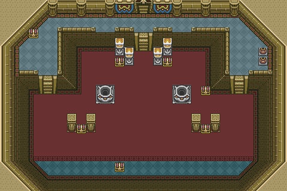

# Meu portfolio versão Zelda game 16 bits (teste)

Este é o meu portfolio inspirado no estilo visual dos jogos do Zelda em 16 bits.

## Acesso ao Portfolio

Para acessar o portfolio, [clique aqui](https://github.com/concs-niemeyer/portfolioGameRPG_v0.1).

## Descrição

Este projeto foi desenvolvido com o objetivo de demonstrar minhas habilidades de programação e design, apresentando meu trabalho de uma maneira criativa e divertida, inspirada nos clássicos jogos de aventura.

## Funcionalidades

- **Design Retro:** Interface e elementos gráficos inspirados em jogos de aventura do Super Nintendo.
- **Navegação Intuitiva:** Explore meu portfolio como se estivesse em uma jornada épica de aventura.
- **Projetos Destacados:** Apresentação dos meus principais projetos de forma clara e organizada.

## Tecnologias Utilizadas

- HTML5
- CSS3
- JavaScript

## Screenshots

## Contribuição

Contribuições são sempre bem-vindas! Sinta-se à vontade para abrir issues e pull requests com sugestões, melhorias ou correções de bugs.
